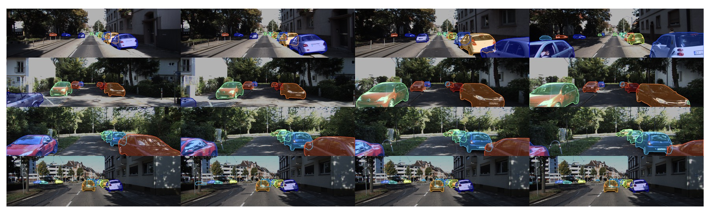

# SaVos
This is the official implementation of the NeurIPS'22 paper [Self-supervised Amodal Video Object Segmentation](https://arxiv.org/abs/2210.12733) . The code was implemented by [Jian Yao](https://github.com/nigelyaoj), [Yuxin Hong](https://github.com/Solidays-Hung) and [Jianxiong Gao](https://github.com/Jianx-Gao)  during their internship at the AWS Shanghai AI Lab. 



The FishBowl dataset originates from [Unsupervised Object Learning via Common Fate](https://arxiv.org/abs/2110.06562). In this repo, we provide the checkpoint and 1000 videos for testing. The train and test video data in this dataset are generated from the same script with different seeds using the [open-sourced code](https://github.com/amazon-science/common-fate-fishbowl).
The data provided includes raw video data, predicted visible masks obtained by PointTrack, and flow obtained by Flownet2.


# Set up
```bash
pip install -r requirement.txt
```


# FishBowl
### Download FishBowl data
Down the [test data](https://dgl-data.s3.us-west-2.amazonaws.com/dataset/SaVos_release/FISHBOWL/FISHBOWL_test_data.zip)  and [checkpoint](https://dgl-data.s3.us-west-2.amazonaws.com/dataset/SaVos_release/FISHBOWL/FISHBOWL_release_model.ckpt).

### Download the csv for evaluation
We currently filter the data (e.g. filtered by Occ rate as described in paper) and write into csv, to evalute, please download the [test file](https://dgl-data.s3.us-west-2.amazonaws.com/dataset/SaVos_release/test_files.zip)


```bash
mv PATH_TO_TEST_DATA VideoAmodal/FishBowl/FishBowl_dataset/data/test_data
mv PATH_TO_CHECKPOINT VideoAmodal/FishBowl/log_bidirectional_consist_next_vm_label_1.5bbox_finalconsist/best_model.pt
mv PATH_TO_TEST_FILES VideoAmodal/FishBowl/test_files
```


### Inference

```bash
cd FishBowls
TRAIN_METHOD="bidirectional_consist_next_vm_label_1.5bbox_finalconsist"
python -m torch.distributed.launch --nproc_per_node=4 \
main.py --mode test --training_method ${TRAIN_METHOD} \
--log_path log_${TRAIN_METHOD} --device cuda --batch_size 1 \
--data_path "" --num_workers 2 --loss_type BCE \
--enlarge_coef 1.5
```


### Training
If you generate the training data (raw video data, flow and predict visible mask), you can train by:


```bash
cd FishBowl
TRAIN_METHOD="bidirectional_consist_next_vm_label_1.5bbox_finalconsist"
python -m torch.distributed.launch --nproc_per_node=4 \
main.py --mode train --training_method ${TRAIN_METHOD} \
--log_path log_${TRAIN_METHOD} --device cuda --batch_size 3 \
--data_path "" --num_workers 2 --loss_type BCE --verbose \
--enlarge_coef 1.5 2>&1 | tee log_${TRAIN_METHOD}.log
```


# Kins-Car

### Download Kitti & Kins data
Download the [data](https://dgl-data.s3.us-west-2.amazonaws.com/dataset/SaVos_release/KINS_Video_Car/KINS_Video_Car.zip) . 

```bash
mv PATH_TO_KINS_VIDEO_CAR Kins_Car/dataset/data
```


### Training
```bash
cd Kins_Car
TRAIN_METHOD="bidirectional_consist_next_vm_label_1.5bbox_finalconsist"
python -m torch.distributed.launch --nproc_per_node=4 \
main.py --mode train --training_method ${TRAIN_METHOD} \
--log_path log_${TRAIN_METHOD} --device cuda --batch_size 2 \
--data_path "" --num_workers 2 --loss_type BCE --verbose \
--enlarge_coef 1.5 2>&1 | tee log_${TRAIN_METHOD}.log
```


### Inference

```bash
cd Kins_Car
TRAIN_METHOD="bidirectional_consist_next_vm_label_1.5bbox_finalconsist"
python -m torch.distributed.launch --nproc_per_node=1 test.py --training_method ${TRAIN_METHOD}
```


### Evaluation
```bash
cd Kins_Car
python eval.py
```


### Visualization
```bash
cd Kins_Car
python run_video_res.py
```

### Chewing Gum Dataset
For whom are interested in the synthetic dataset, we also provide the script to generate the Chewing Gum Dataset in utils/gen_chewgum.py.
